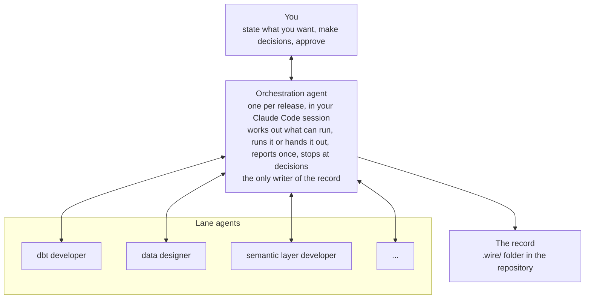

# How Wire Works

Over the last three chapters you have watched Wire set up engagements, draft and check documents, build models in parallel, refuse a request whose approval was missing and stop at every review for your decision, and you have done all of it without typing a command or learning a single piece of Wire's vocabulary. That was deliberate, because the method is what matters and the vocabulary can wait. By now, though, you will have questions. What was actually happening when Wire said it was "drafting the conceptual model in the background"? How did it know that the data model and the sample data could run at the same time but that the dbt models had to wait? Where did the two pieces of work go, and what came back? And when it said "recorded", recorded where?

This chapter answers those questions. It is written for anyone who has followed Chapters 2 to 4 and now wants to understand the machinery, and from here on it uses Wire's own names for things: artifacts, commands, agents and the record. We will start with a high-level walkthrough of what happens between your message and Wire's reply, then look at each component in turn, and we will finish with the other ways of running Wire and with what it connects to. Let's start though with the walkthrough.

## What Happens Between Your Message and the Reply?

Considering a single directive from your point of view, "approve the requirements and carry on", the components perform the following functions, in this order:

1. You type the directive into Claude Code.
2. The **orchestration agent**, which is the part of Wire you are talking to, re-reads the record of the release from disk. It never acts on a plan it formed earlier, because a lane may have finished or someone may have typed a command since you last spoke.
3. It records your approval, under your name, by running the review command for the requirements.
4. It reads the definition of the kind of release you are running and works out, for every artifact in the release, whether it can run now, is waiting on you, is blocked by something upstream, is not part of this release or is already complete.
5. It tells you, in one sentence, what it is about to do and why: "Requirements approval releases two: the conceptual model, in the background, and the prototype, with you here."
6. It runs the generate command for the prototype itself, because that artifact needs your input, and it hands the conceptual model to a **lane agent**, a specialist that will do that one task in its own part of the repository.
7. The lane agent runs the generate command for the conceptual model, writes the artifact and its own state file and reports back once: complete, stalled or in need of a ruling.
8. The orchestration agent checks the lane's work (the files exist, the checks ran and passed, the lane wrote nothing it should not have), and then writes the record: the artifact's new state, a row in the execution log and any ruling you gave along the way.
9. Finally, it reports back to you, outcome first and in plain words, ending with a line that names the commands that ran.

Everything else in this chapter is a closer look at one of the things named in that list.



## So What Is a Release, Exactly?

**Artifact** An artifact is any one of the things Wire produces: the requirements document, the data model, the set of dbt models, the dashboards, the runbook. Each has a state in the record, and each is produced and checked by its own commands.

**Release type** A release type is the written definition of one kind of release, listing its artifacts in phases and, for each artifact, what must be true before it can start. It is the release type that told the orchestration agent, in step 4 above, what could run.

Here is the dashboards-first release from Chapter 2, simplified to its artifacts and what each waits for:

| Artifact | Waits for |
|---|---|
| `business_rules` (optional) | nothing |
| `requirements` | nothing |
| `conceptual_model` | requirements approved; business rules approved (advisory) |
| `mockups` | requirements approved |
| `viz_catalog` | mockups approved |
| `data_model` | chart catalogue complete |
| `seed_data` | chart catalogue complete |
| `dbt` | seed data approved |
| `semantic_layer` | dbt checks pass |
| `dashboards` | semantic layer approved |
| `data_refactor` | dashboards approved |
| `data_quality`, `uat` | dbt approved; dashboards approved |
| `deployment` | data quality checks pass; acceptance approved |
| `training`, `documentation` (optional) | dashboards approved |

Read down the "waits for" column and Chapter 2 explains itself. The conceptual model and the prototype started together because both wait only for the requirements; the data model and the sample data ran together because both wait only for the catalogue; and nothing at all could start while the prototype was parked, because everything below it in the table waits, directly or indirectly, on the prototype being approved. Parallelism in Wire comes from this graph and not from a guess about what is safe to run at once.

**Profile** A profile is a named variant of a release type that switches phases on or off and changes what some artifacts wait for. The dashboards-first release has a "seeded" profile (build on sample data first, which is what Northwind used) and a "live data" profile (skip the sample data because the real tables already exist), and the discovery release has "diagnostic" and "modelling-led". Wire asks which profile to use at setup, and records the answer.

There are 12 release types with a written definition, together with a custom release type for which you define the artifacts yourself, and Part 2 has [a page for each](../getting-started/release-types.md).

## Where Do the Commands Come In?

**Command** A command is a Wire action you can type into Claude Code, of the form `/wire:<name> <release>`, and everything Wire does on a release is a command. Most artifacts have three of them:

| Step | Command | What it does |
|---|---|---|
| Generate | `/wire:<artifact>-generate <release>` | Reads the upstream artifacts and the templates and writes the artifact |
| Validate | `/wire:<artifact>-validate <release>` | Runs the checks and produces a pass or fail report |
| Review | `/wire:<artifact>-review <release>` | Records an approval, with a name, after gathering comments and meeting context |

For most artifacts the validate step runs automatically as part of generate, which is why Chapters 2 to 4 kept saying "drafted, all checks pass" in a single breath. A few artifacts run validate separately because their checks do real work rather than reading files: the dbt validate step runs the tests against the warehouse, and the pipeline and deployment checks touch live systems. The review step, however, is never run on Wire's own judgment, and at every review edge the orchestration agent stops and asks for one of three answers:

| You answer | What runs | What is recorded |
|---|---|---|
| Approve now | the review command | An approval under your name |
| Changes | generate again | Your change list, then the new version |
| Park for the client | nothing | A parked decision naming who is expected to answer |

Wire has 334 commands in total, of which the great majority are these generate, validate and review triads, and the rest are management commands (`/wire:new`, `/wire:start`, `/wire:status`) and utilities for committing, raising a pull request, running dbt and syncing to Jira. [Part 2 lists them all](../reference/commands.md). To make the mapping concrete, here is Chapter 2 again with the commands that ran behind each thing you saw:

| What you saw | Commands that ran |
|---|---|
| "Engagement set up" | `/wire:new` |
| "Requirements drafted, all checks pass" | `requirements-generate`, `requirements-validate` |
| "Approved under your name" | `requirements-review` |
| The workshop pack | `workshops-generate` |
| The conceptual model | `conceptual_model-generate`, `-validate`, `-review` |
| The prototype and its two rounds | `mockups-generate` (twice), `mockups-review` |
| The chart catalogue and data requirements | `viz_catalog-generate` |
| The data model, and the library proposal | `data_model-generate`, `-validate`, `-review` |
| The sample data | `seed_data-generate`, `-validate`, `-review` |
| Models on sample data | `dbt-generate`, `dbt-validate`, `dbt-review` |
| The semantic layer | `semantic_layer-generate`, `-validate`, `-review` |
| The dashboards | `dashboards-generate`, `-validate`, `-review` |
| Switching to real data | `data_refactor-generate`, `-validate`, `-review` |
| Tests and acceptance | `data_quality-*`, `uat-*` |
| The runbook | `deployment-generate`, `-validate`, `-review` |
| The training session | `training-generate` |

Since version 4.0 every report Wire makes ends with a line naming the commands that ran, so that you learn the names as you go rather than up front, and Chapter 6 shows that line and the occasions on which typing a command yourself is the better choice.

## What Does the Orchestration Agent Actually Do?

**Orchestration agent** The orchestration agent is the single agent, one per release, that runs in your Claude Code session, reads your directives, works out what can run, runs it or hands it to a lane and writes the record. It is the only thing that writes the record.

On every message from you it re-reads the record and then classifies every artifact in the release into one of five states:

| State | Meaning |
|---|---|
| Runnable | The generate (or a separate validate) can run now |
| Parked, needs a ruling | A decision of yours is needed; every review is here |
| Blocked | Something upstream is not approved or has not passed, and Wire names it |
| Not applicable | Not part of this release under the chosen profile |
| Complete | Every step done |

Everything runnable that does not depend on anything else runnable can run at the same time, up to the limit you set, and before running anything the agent says what will happen in one sentence with the reason. Work that does not need you goes to a lane; work that does, such as the dashboard prototype, is done with you in the conversation. When the work is done or a decision is needed it reports once, outcome first, and it does not narrate progress in between, because a running commentary is noise and the state files tell it everything it needs to know.

**Ruling** A ruling is any decision you give, and it is written to the record the moment you give it, with the time, your name, what it applies to and your reason. "Skip business rules, agree at kickoff" became a ruling in Chapter 2 before anything else happened, so that a session ending a minute later would have lost nothing.

**Parked decision** A parked decision is a question waiting on you or on someone at the client, and a release can carry several at once. The first line of every session is the list of them, which is why Chapters 2 to 4 always opened with "one decision is waiting".

**Budget** A budget is an optional set of limits you give at the start: how many lanes may run at once, whether anything may query a warehouse and where to stop (at every decision, at the end of each phase, or never). Chapter 2 set two lanes and no warehouse queries, and Wire reports anything it did not do because of the budget rather than silently dropping it.

**Claim** A claim is the orchestration agent's note in the record that a particular person's session is directing the release. One person directs a release at a time; a second person opening the same release is offered the choice of joining as a reviewer, moving to another release or, if the first session has been silent for 30 minutes, taking over.

## And the Lane Agents?

**Lane agent** A lane agent is one of 13 specialists to which the orchestration agent hands a single scoped task, and which does that task in its own part of the repository and reports back once. The 13 are:

| Agent | Does |
|---|---|
| `discovery-analyst` | Requirements, workshops, every discovery artifact |
| `data-designer` | Conceptual model, pipeline design, standard mockups and chart catalogue |
| `dashboard-mock-developer` | Interactive dashboard prototypes for dashboards-first releases |
| `mock-data-developer` | Sample data, and the later switch from sample data to real sources |
| `pipeline-engineer` | Fivetran, Airbyte and dlt connector configuration |
| `dbt-developer` | Staging, integration and warehouse models |
| `semantic-layer-developer` | LookML views, explores and dashboards |
| `orchestration-engineer` | Scheduling and job configuration |
| `data-quality-engineer` | Data quality tests, field documentation, acceptance testing |
| `migration-specialist` | Platform migrations: audits, inventory, strategy, cutover |
| `delivery-lead` | Deployment runbooks, training, kickoff, documentation |
| `agentic-data-stack-developer` | Canonical models, knowledge skills, agent configuration, evaluation suites |
| `qa-agent` | Checks other agents' output; produces nothing itself |

Every lane works under the same contract, which the orchestration agent states in full each time it dispatches one. A lane has one scoped task, in named directories that no other live lane is writing to. It keeps its own state file, rewritten after each completed item, so that a lane which dies part way through is resumed from where it got to and loses at most one item. It reports once, as complete, stalled or in need of a ruling. It is "flat", meaning that it never starts agents of its own. And it never writes the record; the orchestration agent reads the lane's state file and writes the record itself.

:::note
Each of those rules exists because of a real failure on a real engagement. Nested agents starting their own agents produced two hard usage-limit outages in a single day; two lanes writing to the same directory corrupted each other's files; and concurrent writes to the record silently discarded a day's completed work. The contract is not tidiness, it is the fix.
:::

When a dbt layer has more than five models it is split into batches of five, one lane each, all run at the same time, but the layers themselves still run in order: every staging lane finishes before the integration lane starts, which finishes before the warehouse lanes start. That is the "two pieces at the same time, then one, then two" you saw in Chapter 3.

## Where Is All This Recorded?

**The record** The record is the set of plain text files under `.wire/` in the repository that hold the state of every artifact, every command run and every decision, and it is identical whether you directed the work or typed every command yourself.

```
.wire/
  engagement/
    context.md              # client, lead, integrations, orchestration mode
  releases/
    01-store-performance/
      status.md             # state of every artifact, profile, budget, parked decisions, the claim
      execution_log.md      # one row per command run
      decisions.md          # every ruling, the moment it was given
      lanes/                # one state file per lane
      requirements/         # the artifacts themselves, by phase
      design/
      development/
      ...
```

Three of those files matter most. `status.md` holds the current state of every artifact (generate complete, validate pass, review approved), together with the chosen profile, the budget, the list of parked decisions and who holds the claim. `execution_log.md` has one row per command run, giving the time, the command, the result, a detail line, who ran it and a Session column that says whether the command was typed by a person, run by the orchestration agent, run by a lane or run by autopilot. `decisions.md` holds every ruling: an id, the time, your name, a short summary, what it applies to, the ruling itself and your reason. As such, a colleague joining a release reads these three files and knows where it is, who decided what, and why.

## What Stops a Step Running Too Early?

**Precondition gate** The precondition gate is the check every generate, validate and review command runs before it does anything, comparing what the release type says the artifact waits for against what the record says has actually happened.

It is the gate, and not the orchestration agent's discretion, that refused "start the dbt models" in Chapter 3, because the record showed the data model review as not yet approved. A gate is either "blocking" or "advisory". A blocking gate can be passed only by a person giving their name and a reason, both of which are recorded in the log, and it is never satisfied by a ruling. An advisory gate, such as the business rules gate on the first design artifact, warns, and can be satisfied by a recorded ruling such as "skip, agree at kickoff".

:::note
A ruling never satisfies a blocking gate, however sensible the ruling. If you find yourself wanting to override a blocking gate, the recorded override with your name and reason is the route, and it is deliberately more effort than approving the upstream artifact properly.
:::

## What If You Would Rather Type?

Nothing about the record changes if you do, and there are four ways to take the wheel. You can simply type a command, which always works in any session, after which the orchestration agent re-reads the record and carries on from wherever that left things. You can say "you drive", which stops the orchestration agent dispatching anything for the rest of the session while it still answers questions and runs what you ask, and "I'll drive" (or any instruction to do work) hands control back, with both recorded. You can set manual mode for a whole engagement, one setting in the engagement context that restores the pre-4.0 behaviour exactly, so that you type commands and `/wire:start` prints the next one rather than offering to run it. And if you are on Gemini CLI, which has no agents or skills, you are always in manual mode; the commands, the gate and the record are the same, as we noted in Chapter 1.

At the other end of the range from typing everything is `/wire:autopilot`, which runs a whole release unattended, answers its own review gates from each artifact's stated review criteria and records itself as the reviewer, and pauses at any blocked gate rather than pushing through. [Part 2 describes it](../advanced/autopilot.md).

## Where Do the Definitions Come From?

The release-type definitions and the command specifications together are the method, and they are kept in a separate registry, changed only through reviewed pull requests and pinned to a version inside Wire. Wire never fetches them live, and a check fails if the local copy has been changed by any route other than a sync, so that the method you are following is always a known version of the method. Naming and style conventions for dbt, LookML and Cube are machine-readable files in the same arrangement, and a client project can override any of them with its own.

## What Does Wire Connect To?

Wire uses Model Context Protocol servers (a standard way for an assistant to call an external tool, usually shortened to MCP) for everything outside the repository. When they are configured, review commands read meeting recordings from Fathom for relevant decisions, which is how Chapter 4's playback checklist was filled from the sponsor's own words; generate, validate and review commands update Jira or Linear as each step completes; generated documents are published to Confluence or Notion and reviewer comments are read back into the review; and the specialist agents read from and write to BigQuery, Snowflake, Looker, Omni, Fivetran, dbt Cloud and others. If a server is unavailable the command proceeds without it and says so. [Part 2 lists them](../reference/mcp-servers.md).

For the operating rules in full, including the claim, sessions and parked decisions, see [the operating model](../advanced/release-director.md) in Part 2; for each specialist and the lane contract, see [the agents](../advanced/wire-agents.md); and for how a single command file is structured and read, see [Anatomy of a command](../getting-started/how-wire-works.md). In the next chapter we run the largest kind of release and, now that you know what the commands are, look at the occasions on which typing one yourself is the better choice.
