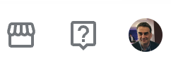
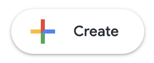

# Looker Dashboard Design System Reference

Complete CSS, HTML component patterns, and Chart.js configurations.
Copy verbatim — do not improvise colours or class names.

---

## 1. CSS Custom Properties

```css
:root {
  --bg: hsl(200,20%,98%);
  --fg: hsl(207,12%,17%);
  --card: hsl(0,0%,100%);
  --card-fg: hsl(207,12%,17%);
  --primary: hsl(195,55%,22%);
  --primary-fg: hsl(0,0%,100%);
  --secondary: hsl(195,20%,94%);
  --muted: hsl(195,15%,92%);
  --muted-fg: hsl(200,15%,45%);
  --accent: hsl(22,80%,53%);
  --accent-fg: hsl(0,0%,100%);
  --border: hsl(195,15%,88%);
  --success: hsl(165,60%,40%);
  --warning: hsl(45,93%,47%);
  --destructive: hsl(0,72%,51%);
  --sidebar-bg: hsl(195,55%,20%);
  --sidebar-fg: hsl(195,15%,95%);
  --sidebar-accent: hsl(195,45%,28%);
  --sidebar-border: hsl(195,40%,30%);
  --sidebar-active: hsl(22,80%,58%);
  --chart-1: #4285F4;   /* Google blue */
  --chart-2: #EA4335;   /* Google red */
  --chart-3: #FBBC04;   /* Google yellow */
  --chart-4: #34A853;   /* Google green */
  --chart-5: #FF6D00;   /* Google orange */
  --chart-6: #7E57C2;   /* Google purple */
  --chart-7: hsl(49,68%,61%);    /* gold */
  --chart-8: hsl(30,50%,61%);    /* tan */
  --chart-9: hsl(73,68%,61%);    /* lime */
  --chart-10: hsl(97,55%,50%);   /* green */
  --chart-11: hsl(350,44%,58%);  /* rose */
  --chart-12: hsl(185,60%,64%);  /* sky */
  --radius: 6px;
  --shadow-sm: 0 2px 6px rgba(0,0,0,0.08);
  --shadow-md: 0 4px 12px rgba(0,0,0,0.12);
}
```

---

## 2. Base & Reset CSS

```css
*, *::before, *::after { box-sizing: border-box; margin: 0; padding: 0; border: 0; }
html, body { height: 100%; }
body {
  font-family: 'Google Sans', system-ui, sans-serif;
  font-size: 13px;
  color: var(--fg);
  background: var(--bg);
  display: flex;
  flex-direction: column;
  min-height: 100vh;
}
a { text-decoration: none; color: inherit; }
button { cursor: pointer; background: none; font-family: inherit; }
```

---

## 3. Header Component

```html
<header class="header">
  <div class="header-left">
    <button class="icon-btn" onclick="toggleSidebar()">
      <!-- hamburger SVG -->
      <svg viewBox="0 0 24 24" fill="none" stroke="currentColor" stroke-width="2">
        <line x1="3" y1="6" x2="21" y2="6"/>
        <line x1="3" y1="12" x2="21" y2="12"/>
        <line x1="3" y1="18" x2="21" y2="18"/>
      </svg>
    </button>
    <div class="looker-logo">
      
      Looker
    </div>
  </div>
  <div class="header-right">
    
    <!-- Avatar: use initials from user's name -->
    <div class="avatar">AB</div>
  </div>
</header>
```

Header CSS:
```css
.header {
  height: 48px; background: var(--card);
  border-bottom: 1px solid var(--border);
  display: flex; align-items: center; justify-content: space-between;
  padding: 0 12px; position: sticky; top: 0; z-index: 100;
}
.header-left { display: flex; align-items: center; gap: 8px; }
.header-right { display: flex; align-items: center; gap: 4px; }
.icon-btn {
  width: 32px; height: 32px;
  display: flex; align-items: center; justify-content: center;
  border-radius: 4px; color: var(--muted-fg); transition: background 0.15s;
}
.icon-btn:hover { background: var(--muted); }
.icon-btn svg { width: 18px; height: 18px; }
.looker-logo {
  display: flex; align-items: center; gap: 6px;
  font-size: 17px; font-weight: 500; color: var(--primary); letter-spacing: -0.3px;
}
.looker-logo img { width: 35px; height: 35px; }
.avatar {
  width: 28px; height: 28px; border-radius: 50%;
  background: linear-gradient(135deg, hsl(210,60%,55%), hsl(195,55%,40%));
  display: flex; align-items: center; justify-content: center;
  font-size: 11px; font-weight: 600; color: white;
}
```

---

## 4. Sidebar Component

```html
<aside class="sidebar" id="sidebar">
  <!-- Create button image -->
  <button class="sidebar-create">
    
  </button>

  <!-- Section 1: Core nav -->
  <div class="sidebar-section">
    <div class="sidebar-item" onclick="setActive(this)">
      <!-- compass icon --> <svg>…</svg> <span>Explore</span>
    </div>
    <div class="sidebar-item" onclick="setActive(this)">
      <!-- chat icon --> <svg>…</svg> <span>Conversations</span>
    </div>
    <div class="sidebar-item" onclick="setActive(this)">
      <!-- code icon --> <svg>…</svg> <span>Develop</span>
    </div>
    <div class="sidebar-item" onclick="setActive(this)">
      <!-- settings icon --> <svg>…</svg> <span>Admin</span>
    </div>
  </div>

  <div class="sidebar-divider"></div>

  <!-- Section 2: Navigation -->
  <div class="sidebar-section">
    <div class="sidebar-item active" onclick="setActive(this)">
      <!-- home icon --> <svg>…</svg> <span>Home</span>
    </div>
    <div class="sidebar-item" onclick="setActive(this)">
      <!-- clock icon --> <svg>…</svg> <span>Recently Viewed</span>
    </div>
    <div class="sidebar-item" onclick="setActive(this)">
      <!-- star icon --> <svg>…</svg> <span>Favorites</span>
    </div>
    <div class="sidebar-item" onclick="setActive(this)">
      <!-- grid icon --> <svg>…</svg> <span>Boards</span>
    </div>
  </div>
</aside>
```

Sidebar CSS:
```css
.body { display: flex; flex: 1; overflow: hidden; }
.sidebar {
  width: 208px; background: var(--card);
  border-right: 1px solid var(--border);
  display: flex; flex-direction: column; flex-shrink: 0;
  transition: width 0.2s ease; overflow: hidden;
  height: calc(100vh - 48px); position: sticky; top: 48px;
}
.sidebar.collapsed { width: 44px; }
.sidebar-create {
  margin: 10px 10px 6px; padding: 6px 10px;
  border-radius: var(--radius); border: 1.5px solid var(--border);
  display: flex; align-items: center; gap: 8px;
  font-size: 13px; font-weight: 500; color: var(--fg);
  transition: box-shadow 0.15s; white-space: nowrap;
}
.sidebar-create:hover { box-shadow: var(--shadow-sm); }
.rainbow-icon { width: 18px; height: 18px; flex-shrink: 0; }
.sidebar-divider { height: 1px; background: var(--border); margin: 6px 0; }
.sidebar-item {
  display: flex; align-items: center; gap: 10px;
  padding: 6px 12px; border-radius: 4px; margin: 1px 6px;
  font-size: 13px; font-weight: 400; color: hsl(207,12%,35%);
  transition: background 0.1s; cursor: pointer; white-space: nowrap;
}
.sidebar-item svg { width: 16px; height: 16px; flex-shrink: 0; }
.sidebar-item:hover { background: hsl(210,50%,95%); color: hsl(210,70%,40%); }
.sidebar-item.active {
  background: hsl(210,50%,93%); color: hsl(210,70%,40%); font-weight: 500;
}
```

---

## 5. Title Bar

```html
<div class="titlebar">
  <div class="breadcrumb">
    <a href="#">All Folders</a>
    <span class="breadcrumb-sep">›</span>
    <a href="#">[Folder Name]</a>
    <span class="breadcrumb-sep">›</span>
    <span>[Dashboard Title]</span>
  </div>
  <div class="title-row">
    <div><h1>[Dashboard Title]</h1></div>
    <div class="title-actions">
      <!-- heart, folder+, refresh, more-vertical buttons -->
      <button class="title-icon-btn">…</button>
    </div>
  </div>
</div>
```

Title bar CSS:
```css
.titlebar { background: var(--card); border-bottom: 1px solid var(--border); padding: 0 16px; }
.breadcrumb {
  display: flex; align-items: center; gap: 4px;
  padding: 8px 0 4px; font-size: 11px; color: var(--muted-fg);
}
.breadcrumb-sep { color: var(--border); }
.title-row {
  display: flex; align-items: center; justify-content: space-between; padding-bottom: 8px;
}
.title-row h1 { font-size: 16px; font-weight: 600; color: var(--fg); }
.title-actions { display: flex; align-items: center; gap: 2px; }
.title-icon-btn {
  width: 28px; height: 28px; display: flex; align-items: center; justify-content: center;
  border-radius: 4px; color: var(--muted-fg);
}
.title-icon-btn:hover { background: var(--muted); }
.title-icon-btn svg { width: 15px; height: 15px; }
```

---

## 6. Filter Bar

```html
<div class="filter-bar">
  <div class="filter-pill-wrap">
    <div class="filter-pill-label">Date Range</div>
    <div class="filter-pill">
      Apr 1 – Apr 14, 2026
      <svg viewBox="0 0 24 24" fill="none" stroke="currentColor" stroke-width="2.5">
        <polyline points="6 9 12 15 18 9"/>
      </svg>
    </div>
  </div>
  <!-- Repeat .filter-pill-wrap for each filter dimension -->
  <!-- For multi-select with selections, show values only — no count badge -->
  <div class="filter-pill-wrap">
    <div class="filter-pill-label">Status</div>
    <div class="filter-pill">
      Active, Proposed, …
      <svg viewBox="0 0 24 24" fill="none" stroke="currentColor" stroke-width="2.5"><polyline points="6 9 12 15 18 9"/></svg>
    </div>
  </div>
  <button class="run-btn">
    <svg style="width:12px;height:12px" viewBox="0 0 24 24" fill="none" stroke="currentColor" stroke-width="2.5">
      <polygon points="5 3 19 12 5 21 5 3"/>
    </svg>
    Run
  </button>
</div>
```

Filter CSS:
```css
.filter-bar {
  background: var(--card); border-bottom: 1px solid var(--border);
  padding: 8px 16px; display: flex; align-items: flex-end; gap: 12px; flex-wrap: wrap;
}
.filter-pill-wrap { display: flex; flex-direction: column; gap: 3px; }
.filter-pill-label {
  font-size: 10px; font-weight: 400; color: var(--muted-fg);
  text-transform: uppercase; letter-spacing: 0.5px;
}
.filter-pill {
  display: flex; align-items: center; gap: 6px; padding: 4px 10px;
  background: #DAE8FB; border: 1px solid #a8c8f5; border-radius: 4px;
  font-size: 12px; font-weight: 500; color: hsl(210,60%,30%);
  cursor: pointer; white-space: nowrap;
}
.filter-pill svg { width: 12px; height: 12px; }
.filter-pill:hover { background: #c8ddf8; }
.run-btn {
  margin-left: auto; padding: 5px 16px;
  background: hsl(210,70%,45%); color: white;
  border-radius: 4px; font-size: 12px; font-weight: 600;
  display: flex; align-items: center; gap: 6px;
  transition: background 0.15s; border: none;
}
.run-btn:hover { background: hsl(210,70%,38%); }
```

---

## 7. Tab Bar

```html
<div class="tab-bar">
  <div class="tab active" onclick="switchTab(this)">Overview</div>
  <div class="tab" onclick="switchTab(this)">Pipeline</div>
  <div class="tab" onclick="switchTab(this)">Finance</div>
</div>
```

Tab CSS:
```css
.tab-bar {
  display: flex; border-bottom: 1px solid var(--border);
  background: var(--card); padding: 0 16px;
}
.tab {
  padding: 8px 14px; font-size: 12px; font-weight: 400;
  color: var(--muted-fg); border-bottom: 2px solid transparent; cursor: pointer;
}
.tab.active { color: hsl(210,70%,40%); border-bottom-color: hsl(210,70%,40%); }
.tab:hover:not(.active) { color: var(--fg); }
```

---

## 8. Stat Card (KPI Tile)

```html
<div class="kpi-grid">
  <!-- Accent colour cycles: chart-1, chart-3, chart-5, chart-6, chart-2, chart-4 -->
  <div class="stat-card" style="--card-accent: var(--chart-1)">
    <div class="metric-label">Pipeline Value</div>
    <div class="metric-value">£842K</div>
    <div class="metric-sub">Weighted · FY2026-27</div>
    <div class="trend up">
      <!-- up arrow SVG --> ↑ +12.4% vs last month
    </div>
  </div>
</div>
```

Stat card CSS:
```css
.kpi-grid { display: grid; grid-template-columns: repeat(4, 1fr); gap: 12px; }
.stat-card {
  background: var(--card); border: 1px solid var(--border);
  border-radius: var(--radius); padding: 14px 16px;
  box-shadow: var(--shadow-sm); transition: box-shadow 0.2s, border-color 0.2s;
  display: flex; flex-direction: column; align-items: center; text-align: center;
}
.stat-card:hover { box-shadow: var(--shadow-md); border-color: hsla(195,55%,22%,0.2); }
.metric-label {
  font-size: 10px; font-weight: 400; color: var(--muted-fg);
  text-transform: uppercase; letter-spacing: 0.7px; margin-bottom: 6px;
}
.metric-value { font-size: 24px; font-weight: 700; color: var(--fg); letter-spacing: -0.5px; line-height: 1.1; }
.metric-sub { font-size: 11px; color: var(--muted-fg); margin-top: 2px; }
.trend { display: flex; align-items: center; gap: 3px; font-size: 11px; font-weight: 600; margin-top: 6px; }
.trend svg { width: 12px; height: 12px; }
.trend.up { color: var(--success); }
.trend.down { color: var(--destructive); }
.trend.neutral { color: var(--muted-fg); }
```

Trend arrow SVGs:
```html
<!-- Up -->
<svg viewBox="0 0 24 24" fill="none" stroke="currentColor" stroke-width="2.5">
  <line x1="7" y1="17" x2="17" y2="7"/><polyline points="7 7 17 7 17 17"/>
</svg>
<!-- Down -->
<svg viewBox="0 0 24 24" fill="none" stroke="currentColor" stroke-width="2.5">
  <line x1="7" y1="7" x2="17" y2="17"/><polyline points="17 7 17 17 7 17"/>
</svg>
<!-- Neutral -->
<svg viewBox="0 0 24 24" fill="none" stroke="currentColor" stroke-width="2">
  <line x1="5" y1="12" x2="19" y2="12"/>
</svg>
```

---

## 9. Chart Card

```html
<div class="chart-card">
  <div class="chart-header">
    <div>
      <div class="chart-title">Monthly Revenue vs Target</div>
      <div class="chart-subtitle">FY2026-27 · £ GBP</div>
    </div>
    <div style="display:flex;align-items:center;gap:8px">
      <!-- optional viz switcher -->
      <div class="viz-switcher">
        <div class="viz-btn active">Line</div>
        <div class="viz-btn">Bar</div>
      </div>
      <div class="chart-actions">
        <button class="chart-icon-btn"><!-- more-vertical SVG --></button>
      </div>
    </div>
  </div>
  <div class="chart-wrap" style="height:200px">
    <canvas id="uniqueChartId"></canvas>
  </div>
</div>
```

Chart card CSS:
```css
.chart-card {
  background: var(--card); border: 1px solid var(--border);
  border-radius: var(--radius); box-shadow: var(--shadow-sm); padding: 16px;
}
.chart-header { display: flex; align-items: center; justify-content: space-between; margin-bottom: 12px; }
.chart-title { font-size: 12px; font-weight: 700; color: var(--fg); text-transform: uppercase; letter-spacing: 0.5px; }
.chart-subtitle { font-size: 11px; color: var(--muted-fg); margin-top: 2px; }
.chart-wrap { position: relative; }
.viz-switcher {
  display: flex; gap: 2px; background: var(--muted); border-radius: 4px; padding: 2px;
}
.viz-btn { padding: 3px 8px; border-radius: 3px; font-size: 11px; font-weight: 500; color: var(--muted-fg); }
.viz-btn.active { background: var(--card); color: hsl(210,70%,40%); box-shadow: 0 1px 3px rgba(0,0,0,0.1); }
.chart-actions { display: flex; gap: 2px; }
.chart-icon-btn {
  width: 24px; height: 24px; display: flex; align-items: center; justify-content: center;
  border-radius: 3px; color: var(--muted-fg);
}
.chart-icon-btn:hover { background: var(--muted); }
.chart-icon-btn svg { width: 13px; height: 13px; }
```

---

## 10. Chart.js Patterns

### Global defaults (always add at top of script):
```js
Chart.defaults.font.family = "'Google Sans', system-ui, sans-serif";
Chart.defaults.font.size = 11;
Chart.defaults.font.weight = 400;
Chart.defaults.color = 'hsl(200,15%,45%)';
const gridColor = 'hsla(195,15%,88%,0.6)';
```

### Colour palette array (Google standard — use in order):
```js
const chartColors = [
  '#4285F4', '#EA4335', '#FBBC04',
  '#34A853', '#FF6D00', '#7E57C2',
  'hsl(49,68%,61%)', 'hsl(30,50%,61%)', 'hsl(97,55%,50%)',
  'hsl(350,44%,58%)'
];
```

### Line chart:
```js
new Chart(document.getElementById('myChart'), {
  type: 'line',
  data: {
    labels: ['Jan','Feb','Mar','Apr','May','Jun'],
    datasets: [{
      label: 'Actual',
      data: [42, 58, 51, 68, 74, 65],
      borderColor: '#4285F4',
      backgroundColor: 'rgba(66,133,244,0.08)',
      borderWidth: 2, pointRadius: 3, pointHoverRadius: 5, tension: 0.3, fill: true
    }, {
      label: 'Target',
      data: [50, 55, 60, 65, 70, 75],
      borderColor: '#FF6D00',
      backgroundColor: 'transparent',
      borderWidth: 1.5, borderDash: [3,4], pointRadius: 0, tension: 0.3
    }]
  },
  options: {
    responsive: true, maintainAspectRatio: false,
    interaction: { mode: 'index', intersect: false },
    plugins: { legend: { position: 'top', labels: { boxWidth: 10, padding: 14, usePointStyle: true } } },
    scales: {
      y: { grid: { color: gridColor }, beginAtZero: false },
      x: { grid: { color: gridColor } }
    }
  }
});
```

### Vertical bar chart:
```js
new Chart(document.getElementById('myChart'), {
  type: 'bar',
  data: {
    labels: ['Q1','Q2','Q3','Q4'],
    datasets: [{
      label: 'Revenue',
      data: [120, 145, 132, 168],
      backgroundColor: chartColors.slice(0, 4),
      borderRadius: 4, barThickness: 24
    }]
  },
  options: {
    responsive: true, maintainAspectRatio: false,
    plugins: { legend: { display: false } },
    scales: {
      y: { grid: { color: gridColor }, ticks: { callback: v => '£'+v+'K' } },
      x: { grid: { display: false } }
    }
  }
});
```

### Horizontal bar chart (utilisation / ranking):
```js
new Chart(document.getElementById('myChart'), {
  type: 'bar',
  data: {
    labels: ['Alice','Bob','Carol','Dave','Eve'],
    datasets: [{
      data: [88, 72, 91, 65, 79],
      backgroundColor: ctx => {
        const v = ctx.raw;
        if (v >= 80) return '#34A853';
        if (v >= 65) return '#FBBC04';
        return '#EA4335';
      },
      borderRadius: 3, barThickness: 14
    }]
  },
  options: {
    indexAxis: 'y',
    responsive: true, maintainAspectRatio: false,
    plugins: { legend: { display: false } },
    scales: {
      x: { max: 100, grid: { color: gridColor }, ticks: { callback: v => v+'%' } },
      y: { grid: { display: false }, ticks: { font: { size: 10 } } }
    }
  }
});
```

### Doughnut chart:
```js
new Chart(document.getElementById('myChart'), {
  type: 'doughnut',
  data: {
    labels: ['Category A','Category B','Category C','Category D'],
    datasets: [{
      data: [35, 28, 22, 15],
      backgroundColor: chartColors.slice(0, 4),
      borderWidth: 2, borderColor: 'white'
    }]
  },
  options: {
    responsive: true, maintainAspectRatio: false, cutout: '62%',
    plugins: {
      legend: {
        position: 'right',
        labels: { boxWidth: 10, padding: 10, usePointStyle: true, font: { size: 10 } }
      }
    }
  }
});
```

### Area / stacked bar chart:
```js
// Area — same as line but fill: true on all datasets with semi-transparent backgrounds
// Stacked bar — add `stacked: true` to both x and y scale configs
```

---

## 11. Data Table

```html
<div class="table-card">
  <div class="table-card-header">
    <div style="display:flex;align-items:center;gap:8px">
      <span class="chart-title">Table Title</span>
      <span class="row-count">12 rows</span>
    </div>
    <!-- download + columns buttons -->
  </div>
  <table>
    <thead>
      <tr>
        <th>Column A <span class="sort-icon">↕</span></th>
        <th class="td-num">Value <span class="sort-icon">↑</span></th>
        <th>Status <span class="sort-icon">↕</span></th>
        <th>Progress <span class="sort-icon">↕</span></th>
      </tr>
    </thead>
    <tbody>
      <tr>
        <td><strong>Item Name</strong></td>
        <td class="td-num">£124,000</td>
        <td><span class="badge badge-green">Active</span></td>
        <td>
          <div class="mini-bar-wrap">
            <div class="mini-bar-bg">
              <div class="mini-bar" style="width:65%;background:var(--chart-1)"></div>
            </div>
            <span class="pct">65%</span>
          </div>
        </td>
      </tr>
    </tbody>
  </table>
  <!-- Bottom tab strip — always include -->
  <div style="border-top:1px solid var(--border);display:flex;gap:0;padding:0 8px;">
    <div style="padding:6px 10px;font-size:11px;font-weight:500;color:hsl(210,70%,40%);border-bottom:2px solid hsl(210,70%,40%);cursor:pointer">Data</div>
    <div style="padding:6px 10px;font-size:11px;font-weight:500;color:var(--muted-fg);cursor:pointer">Results</div>
    <div style="padding:6px 10px;font-size:11px;font-weight:500;color:var(--muted-fg);cursor:pointer">SQL</div>
    <div style="margin-left:auto;display:flex;align-items:center;font-size:10px;color:var(--muted-fg);gap:4px;padding:0 8px">
      <svg style="width:11px;height:11px" viewBox="0 0 24 24" fill="none" stroke="currentColor" stroke-width="2">
        <circle cx="12" cy="12" r="10"/><line x1="12" y1="8" x2="12" y2="12"/><line x1="12" y1="16" x2="12.01" y2="16"/>
      </svg>
      12 rows · 0.38s
    </div>
  </div>
</div>
```

Table CSS:
```css
.table-card { background: var(--card); border: 1px solid var(--border); border-radius: var(--radius); box-shadow: var(--shadow-sm); }
.table-card-header {
  padding: 12px 16px; border-bottom: 1px solid var(--border);
  display: flex; align-items: center; justify-content: space-between;
}
.row-count {
  font-size: 11px; color: var(--muted-fg); background: var(--muted);
  padding: 2px 7px; border-radius: 10px; font-weight: 500;
}
table { width: 100%; border-collapse: collapse; font-size: 12px; }
thead tr { background: hsl(200,20%,97%); }
th {
  text-align: left; font-size: 10px; font-weight: 400;
  color: var(--muted-fg); text-transform: uppercase; letter-spacing: 0.6px;
  padding: 8px 12px; border-bottom: 1px solid var(--border);
  white-space: nowrap; cursor: pointer; user-select: none;
}
th:hover { background: hsl(195,20%,94%); }
td { padding: 8px 12px; border-bottom: 1px solid hsla(195,15%,88%,0.5); color: var(--fg); }
tr:last-child td { border-bottom: none; }
tr:hover td { background: hsl(210,50%,98%); }
.td-num { text-align: right; font-variant-numeric: tabular-nums; }
.sort-icon { opacity: 0.4; margin-left: 4px; }

/* Badges */
.badge {
  display: inline-flex; align-items: center; justify-content: center;
  padding: 2px 7px; border-radius: 10px;
  font-size: 10px; font-weight: 600; letter-spacing: 0.3px;
}
.badge-green  { background: hsl(165,50%,90%); color: hsl(165,60%,30%); }
.badge-orange { background: hsl(30,90%,92%);  color: hsl(22,80%,40%); }
.badge-red    { background: hsl(0,60%,93%);   color: hsl(0,72%,40%); }
.badge-blue   { background: hsl(210,60%,92%); color: hsl(210,70%,35%); }
.badge-purple { background: hsl(270,30%,92%); color: hsl(270,40%,35%); }

/* Mini progress bar */
.mini-bar-wrap { display: flex; align-items: center; gap: 6px; }
.mini-bar-bg { flex: 1; height: 4px; background: var(--muted); border-radius: 2px; overflow: hidden; }
.mini-bar { height: 100%; border-radius: 2px; }
.pct { font-size: 11px; color: var(--muted-fg); width: 32px; text-align: right; }
```

---

## 12. Footer

```html
<footer class="footer">
  <div class="footer-left">
    <strong>[Dashboard Title]</strong>
    <span>· Data refreshed every 30 minutes. Not for external distribution.</span>
  </div>
  <div>Prepared by [Client/Org Name] · <strong>[Date]</strong></div>
</footer>
```

Footer CSS:
```css
.footer {
  border-top: 1px solid var(--border); background: var(--card);
  padding: 6px 16px; display: flex; align-items: center; justify-content: space-between;
  font-size: 11px; color: var(--muted-fg); flex-shrink: 0;
}
.footer-left { display: flex; align-items: center; gap: 8px; }
.footer-left strong { color: var(--fg); font-weight: 600; }
```

---

## 13. JavaScript Helpers

Always include these three functions:
```js
function toggleSidebar() {
  document.getElementById('sidebar').classList.toggle('collapsed');
}
function setActive(el) {
  document.querySelectorAll('.sidebar-item').forEach(i => i.classList.remove('active'));
  el.classList.add('active');
}
function switchTab(el) {
  document.querySelectorAll('.tab').forEach(t => t.classList.remove('active'));
  el.classList.add('active');
}
```

---

## 14. Layout Grid Patterns

```css
.content { padding: 16px; display: flex; flex-direction: column; gap: 16px; }
.main { flex: 1; display: flex; flex-direction: column; overflow-y: auto; min-width: 0; }

/* 4-column KPI row */
.kpi-grid { display: grid; grid-template-columns: repeat(4, 1fr); gap: 12px; }

/* Chart rows */
.charts-row-2-wide   { display: grid; grid-template-columns: 3fr 2fr; gap: 12px; }
.charts-row-equal    { display: grid; grid-template-columns: 1fr 1fr; gap: 12px; }
.charts-row-3        { display: grid; grid-template-columns: 2fr 1fr 1fr; gap: 12px; }
.charts-row-full     { display: grid; grid-template-columns: 1fr; gap: 12px; }

/* Entrance animation */
@keyframes fadeIn { from { opacity: 0; transform: translateY(8px); } to { opacity: 1; transform: translateY(0); } }
.stat-card, .chart-card, .table-card { animation: fadeIn 0.4s ease both; }
.stat-card:nth-child(1) { animation-delay: 0.05s; }
.stat-card:nth-child(2) { animation-delay: 0.10s; }
.stat-card:nth-child(3) { animation-delay: 0.15s; }
.stat-card:nth-child(4) { animation-delay: 0.20s; }
```

---

## 15. Page Skeleton (copy-paste starting point)

```html
<!DOCTYPE html>
<html lang="en">
<head>
  <meta charset="UTF-8"/>
  <meta name="viewport" content="width=device-width, initial-scale=1.0"/>
  <title>[Dashboard Title] – Looker</title>
  <link rel="preconnect" href="https://fonts.googleapis.com">
  <link rel="preconnect" href="https://fonts.gstatic.com" crossorigin>
  <link href="https://fonts.googleapis.com/css2?family=Google+Sans:wght@300;400;500;600;700&display=swap" rel="stylesheet">
  <script src="https://cdnjs.cloudflare.com/ajax/libs/Chart.js/4.4.1/chart.umd.min.js"></script>
  <style>
    /* Paste all CSS from sections 1–14 above */
  </style>
</head>
<body>
  <!-- Header -->
  <!-- Body (sidebar + main) -->
  <!-- Footer -->
  <script>
    Chart.defaults.font.family = "'Google Sans', system-ui, sans-serif";
    Chart.defaults.font.size = 11;
    Chart.defaults.color = 'hsl(200,15%,45%)';
    const gridColor = 'hsla(195,15%,88%,0.6)';
    // toggleSidebar, setActive, switchTab helpers
    // Chart instantiations
  </script>
</body>
</html>
```
